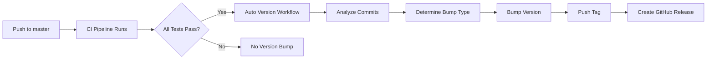

# Auto Versioning System

This project uses a **fully automatic versioning system** powered by [Commitizen](https://commitizen-tools.github.io/commitizen/) and GitHub Actions. Versions are automatically bumped based on your commit messages when CI passes.

## 📋 Overview

The versioning system consists of:
- **`__version__.py`** - Python version variable
- **`pyproject.toml`** - PEP 621 version field
- **`bump_version.py`** - Manual version bump script (optional)
- **Commitizen** - Automatic versioning from conventional commits
- **GitHub Actions** - Automated versioning after CI passes
- **Auto-release** - GitHub releases created automatically

## 🚀 How It Works (Automatic)

### Push to Master → Auto Version & Release



**That's it!** Just push to master with conventional commits, and the system handles everything.

## 📝 Commit Message Format

The system analyzes your commit messages to determine the version bump:

| Commit Type | Version Bump | Example |
|------------|--------------|---------|
| `feat:` | Minor (0.1.0 → 0.2.0) | `feat: add user authentication` |
| `fix:` | Patch (0.1.0 → 0.1.1) | `fix: resolve timeout issue` |
| `perf:` | Patch (0.1.0 → 0.1.1) | `perf: improve query speed` |
| `feat!:` or `fix!:` | Major (0.1.0 → 1.0.0) | `feat!: redesign API` |
| `BREAKING CHANGE` | Major (0.1.0 → 1.0.0) | Any commit with breaking change footer |

### Examples

```bash
# Patch bump (bug fixes)
git commit -m "fix: resolve database connection timeout"
git push origin master
# → Auto bumps: 0.1.0 → 0.1.1

# Minor bump (new features)
git commit -m "feat: add advanced search filters"
git push origin master
# → Auto bumps: 0.1.0 → 0.2.0

# Major bump (breaking changes)
git commit -m "feat!: redesign API endpoints"
git push origin master
# → Auto bumps: 0.1.0 → 1.0.0

# Multiple commits (highest bump wins)
git commit -m "fix: minor bug fix"
git commit -m "feat: new feature"
git push origin master
# → Auto bumps: 0.1.0 → 0.2.0 (minor takes precedence)
```

## 🎯 What Happens Automatically

When you push to master:

1. **CI Pipeline runs** (lint, tests, integration tests)
2. **If CI passes** → Auto-version workflow triggers
3. **Analyzes commits** since last tag
4. **Determines bump type** (major/minor/patch)
5. **Updates version files** (`__version__.py`, `pyproject.toml`)
6. **Creates git tag** (e.g., `0.2.0`)
7. **Pushes changes** back to master
8. **Creates GitHub Release** with changelog

## 🔧 Manual Control (Optional)

For manual versioning, use the bump script:

```bash
# Bump patch version (0.1.0 → 0.1.1)
python bump_version.py --patch

# Bump minor version (0.1.0 → 0.2.0)
python bump_version.py --minor

# Bump major version (0.1.0 → 1.0.0)
python bump_version.py --major

# Preview changes without applying
python bump_version.py --patch --dry-run
```

Then commit and push:
```bash
git add __version__.py pyproject.toml
git commit -m "chore: bump version to 0.1.1"
git tag 0.1.1
git push && git push --tags
```

## 📂 Files Managed by Versioning

These files are automatically updated:

- `__version__.py` - Python runtime version
- `pyproject.toml` - Package metadata version
- `CHANGELOG.md` - Auto-generated by Commitizen

## 🛠️ Workflows

### `.github/workflows/ci.yml`
Main CI pipeline that runs on every push:
- Code quality checks
- Security scanning
- Unit tests
- Integration tests
- Docker build & push (on master/tags)

### `.github/workflows/auto-version.yml`
Triggers after CI passes on master:
- Analyzes commits since last tag
- Determines version bump type
- Runs `cz bump`
- Pushes version changes and tags
- Creates GitHub Release

### `.github/workflows/release.yml`
Triggers on tag push (for manual releases):
- Builds package distribution
- Creates GitHub Release
- Uploads assets

## 💡 Best Practices

1. **Use conventional commits** - The system relies on commit message format
2. **Push to master** - Auto-versioning only triggers on master pushes
3. **Wait for CI** - Don't force push while CI is running
4. **Review releases** - Check GitHub Releases after auto-versioning
5. **Use feature branches** - Merge to master when ready to release

## 🔍 Troubleshooting

### Version didn't bump?
- Check if CI passed (auto-version only runs on successful CI)
- Verify commit messages follow conventional format
- Check workflow runs in GitHub Actions tab

### Manual trigger needed?
Go to GitHub Actions → "Auto Version Bump" → "Run workflow"

### Skip versioning for a commit?
Add `[skip ci]` to commit message:
```bash
git commit -m "docs: update readme [skip ci]"
```

### Force specific version bump?
Use manual method:
```bash
python bump_version.py --minor --dry-run  # Preview
python bump_version.py --minor            # Apply
```

## 📚 Resources

- [Commitizen Documentation](https://commitizen-tools.github.io/commitizen/)
- [Semantic Versioning](https://semver.org/)
- [Conventional Commits](https://www.conventionalcommits.org/)
- [GitHub Actions Documentation](https://docs.github.com/en/actions)
